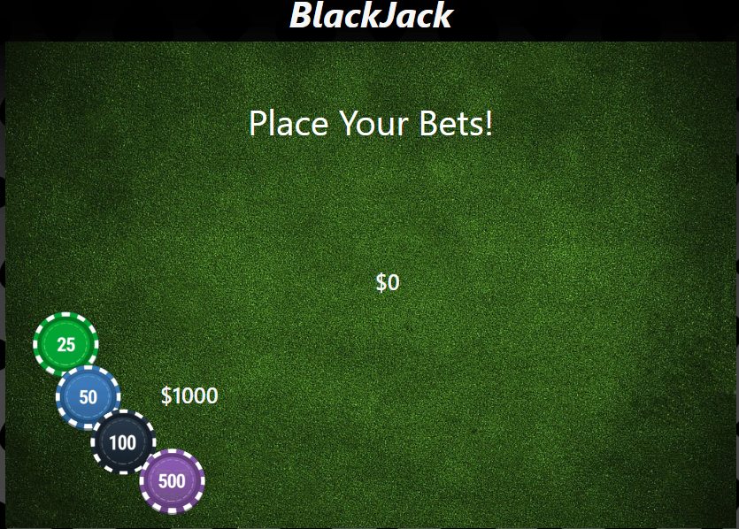
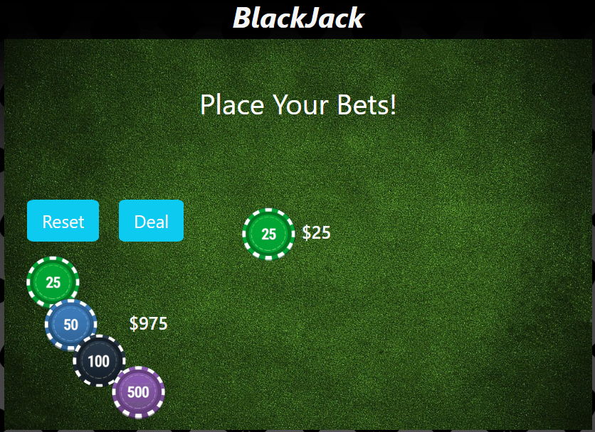
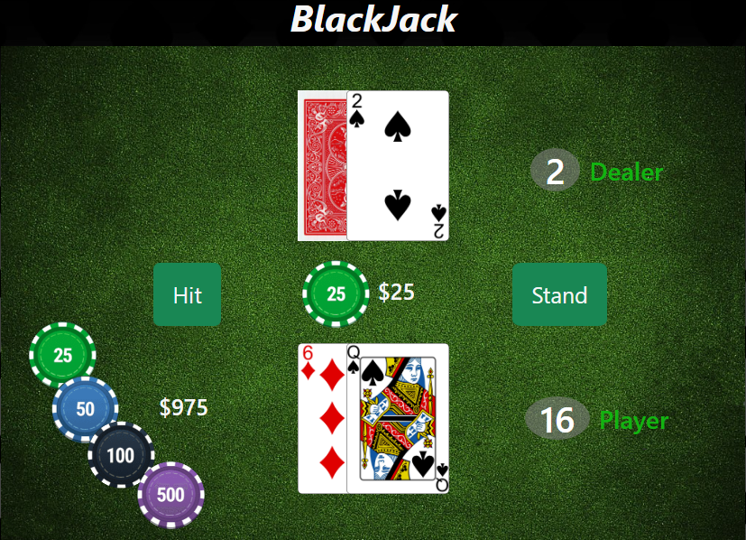

# BlackJack

## Background

Blackjack, also referred to as twenty-one, stands as one of the most widely enjoyed casino games, recognized for its simplicity and broad appeal. This straightforward Blackjack game offers an intuitive interface, making it an ideal choice for players seeking engaging entertainment online.

In Blackjack, players face off against the dealer in a card game played with one or multiple decks. Each card holds its numerical value, with face cards valued at ten and aces valued at either eleven or one (depicted as 11 in our game unless the player exceeds 21). The objective of Blackjack is to outperform the dealer. This can be achieved by obtaining Blackjack (the initial two cards totaling 21) without the dealer having Blackjack, by attaining a higher final card count than the dealer's without surpassing 21, or by avoiding exceeding 21 while the dealer's card count exceeds this limit, resulting in a bust.

    
    
    

## Technologies Used

    
    
    

## Getting Started

The game is deployed through github pages and can be accessed [_here_](https://fir3buster.github.io/Blackjack/)

In Blackjack, also known as 21, players must decide their bet before the hand begins. They can click on the chips to add them to their bet, and they can reset their bet back to their stack of money by clicking the reset button. Once the "deal" button is clicked, the bet is set, and two cards are dealt to the player face up, while two cards are dealt to the dealer, one face up and one face down.

At this point, players must decide whether to "hit" (take another card from the deck) or "stay/stand" (keep the hand they are dealt). Once the Blackjack hand is played out, three outcomes are possible. First, players can win if they beat the dealer's hand without going over 21. In this case, they receive their bet money back plus the same amount from the dealer. If players win with Blackjack (an initial two-card total of 21), they receive their original bet back plus 1.5 times their bet from the dealer. Secondly, players can lose if their hand busts (exceeds 21) or has a lower total than the dealer's hand. In this case, the dealer takes their bet money. Lastly, players can push if they have the same hand total or Blackjack as the dealer. In this case, players keep their bet money but do not win anything additional

## Game Design

HTML elements that are created before run-time:

-   hidden card (card that faces down )
-   chips
-   button types
    1. hit
    2. stand
    3. reset
    4. deal
-   win/loss results

The game design is divided into four main parts written in JavaScript:

### 1. Build and shuffle the Deck

`buildDeck()` - responsible for constructing a complete deck of cards for the game. It generates cards with values ranging from A (Ace) to K (King) and includes all four suits (hearts, diamonds, clubs, spades).

`shuffleDeck()` - shuffle the deck of cards after each round of the game. Shuffling the deck helps prevent card counting strategies by randomizing the order of the cards.

### 2. Place your bet

`placeYourBet()` - a key feature in a Blackjack game that allows players to place their bets using virtual chips. When the game starts or at the beginning, the player is given an initial value of $1000 to use for betting.

`revealPlayerButtons()` - The _Reset_ button allows the player to clear their current bet and return the chips back to their available funds. The _Deal_ button initiates the dealing of cards and begins the round of Blackjack. Once clicked, the game deals two cards to the player and two cards to the dealer, setting the stage for the player's next actions.

### 3. Start the game

`startGame()` - serves as the main entry point for initiating the Blackjack game. It orchestrates the execution of various functions essential for setting up and managing the game:

-   `pointsOfDealer` - responsible for handling the initial distribution of cards to the dealer and computes the dealer's initial points

-   `pointsofPlayer` - responsible for handling the initial distribution of cards to the player and computing the player's initial points.

-   `hitAction` - a function that is executed when a player decides to draw a card during an event listener. It handles the logic associated with the player's decision to take an additional card from the deck.

-   `standAction` - a function that handles the logic when a player decides to stand during the game. Standing means the player chooses not to draw any more cards and to keep their current hand.

### 4. result and reset

`results()` - determine the outcome of a round of the game based on the total points of the dealer and the player.

`reset()` - designed to reset various game-related variables and elements back to their initial state after a round of the game is completed.

## Takeaways

### 1. Game Design Realization:

-   Game design can indeed be more complex than initially anticipated. Starting with simpler projects and gradually adding complexity can be a good approach to avoid feeling overwhelmed.
-   Break down your game design into smaller, manageable components and focus on implementing one feature at a time.

### 2. Code Refactoring

-   Consider using classes and objects to represent game entities such as cards, players, and the dealer.
-   Utilize arrays and loops to manage repetitive tasks and structures more efficiently. For example, you can use arrays to represent the deck of cards and loops to iterate through them.

### 3. CSS animations

-   Leveraging CSS animations such as `@keyframes, fade-ins, and translations` can enhance the visual appeal of your game.
-   CSS animations are often more efficient and smoother than using `setTimeout()` for animations and transitions

### 4. Dynamic Element Creation

-   Creating elements dynamically at runtime can improve performance and simplify game reset logic.
-   Instead of pre-building all elements in the HTML markup, consider generating them programmatically using JavaScript when needed.

## Next Steps

-   Icebox items:
    -   `double()` - double your bet and given only one more card
    -   `insurance()` - if the dealer has an Ace showing, you can click the insurance button (this means you will place a bet worth half your hand bet, which will be paid out if the dealer has Blackjack but will be taken if the dealer does not).
    -   `split()` - allows player to split their initial hand into two separate hands and play them independently.
    -   `hint()/advice()`- provides the player with suggestions and guidance on the optimal decision to make based on the current state of the game.

## Reference

Bicycle Cards., 2022. Learn to play Blackjack[Online]. Available from: {https://bicyclecards.com/how-to-play/blackjack/} [Accessed 17 February 2024]
